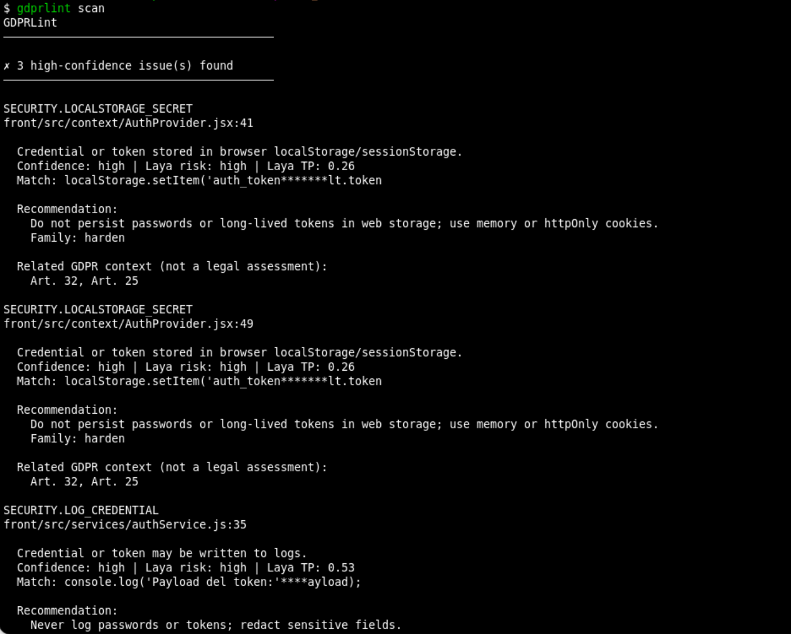
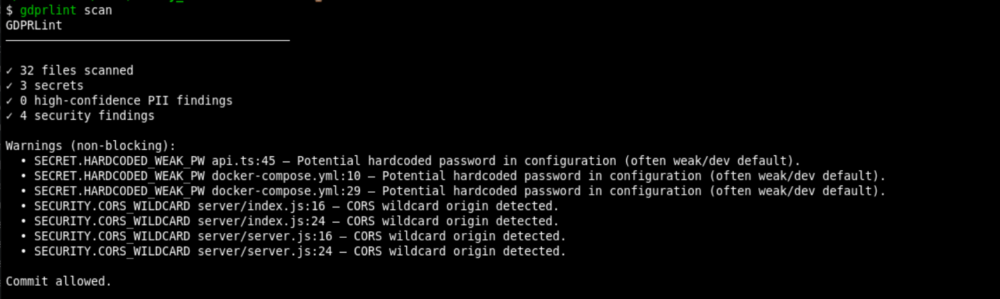

<p align="center">
  
</p>

<h1 align="center">GDPRLint</h1>

<p align="center">
  <strong>Technical privacy and security guardrail for coding agents, enforced at the Git commit boundary.</strong>
</p>

<p align="center">
  
  
  
  
  
  
  
</p>

<p align="center">
  <em>GDPR Lint for the commit boundary — block secrets, PII leaks, and dangerous patterns before they enter history.</em>
</p>

> **GDPRLint is a technical privacy and security guardrail. It does not certify legal or GDPR compliance.**

## Introduction

Coding agents (OpenAI Codex, Claude Code, OpenCode, Cursor, and others) modify repositories at high velocity. GDPRLint inspects **staged Git changes** before they enter history and can **block** commits that introduce secrets, personal data exposures, or basic dangerous code patterns.

```
Coding Agent
    │  modifies files
    ▼
git add .
    │
    ▼
Git staged changes
    │
    ▼
GDPRLint (pre-commit)
    ├── Secrets / credentials
    ├── PII / personal data
    └── Dangerous code patterns
    │  (+ optional Laya local decisor gate)
    ▼
ALLOW / BLOCK
```

## Screenshots

<p align="center">
  
</p>
<p align="center">
  
</p>

## Why it exists

- **Agent-agnostic:** the only integration point is **Git**. Any tool that changes a repo can use it.
- **Privacy by design:** analysis runs **locally**. No code, PII, or secrets are sent to external APIs. Reports **redact** sensitive values.
- **Fail safely:** high-confidence secrets block by default; false positives are configurable.
- **Open source:** Apache-2.0, auditable, extensible rules.

## What it detects (v0.2)

| Category | Examples | Default action |
|---|---|---|
| **Secrets** | AWS keys, GitHub/OpenAI/Google/Slack/Stripe tokens, private keys, JWT, connection strings, hardcoded passwords/API keys, **credentials in URL query**, weak compose/env passwords | **block** (high confidence); `SECRET.HARDCODED_WEAK_PW` → **warn** |
| **PII** | email (placeholder domains ignored), phone (context required; lockfiles skipped), IBAN (ES + international), Spanish DNI/NIE, credit cards (Luhn), SSN/NHS/CPF with context, public IPs, MAC, GPS, DOB, license plates, URL/query PII (incl. password/username params), logging PII (real interpolation only), special-category signals | **warn** |
| **Security** | `eval`/`exec`, `os.system`, `shell=True`, `child_process.exec`, `dangerouslySetInnerHTML`, SQL concat, pickle/unsafe YAML, TLS verify off, CORS `*` (`cors()` / `origin: "*"`), weak RNG for secrets, **credential logging**, **password/token in localStorage** | **warn**; `SECURITY.LOG_CREDENTIAL` + `SECURITY.LOCALSTORAGE_SECRET` → **block** |

PII confidence tiers: `possible` · `likely` · `high`. Names are **not** detected (too many false positives).

## Installation

Requires Python ≥ 3.10 and Git.

```bash
git clone <this-repo>
cd gdprlint
python3 -m venv .venv
source .venv/bin/activate
pip install -e ".[dev]"

gdprlint --version
```

> **First Laya load:** the decisor uses local weights from Hugging Face (`pip` dependency `laya`). The first predict may download a checkpoint (~hundreds of MB). If the network or model is unavailable, GDPRLint **falls back to rules-only mode** and still blocks high-confidence secrets.

## Usage

```bash
# In your project repository
gdprlint init         # optional: write a starter .gdprlint.json
gdprlint list-rules   # inspect the 64 built-in rules and their actions
gdprlint install      # writes .git/hooks/pre-commit (idempotent)

git add .
git commit -m "my change"
# → GDPRLint runs automatically and may block the commit
```

Manual scan:

```bash
gdprlint scan
gdprlint scan --quiet                 # only print when the commit would block
gdprlint scan --no-laya               # rules-only, skip the model gate
gdprlint scan --config path/to.json   # explicit config file
gdprlint scan --all                   # whole worktree: tracked + untracked (non-ignored)
gdprlint scan --history main~3..main  # lines added across a git revision range
```

Machine-readable reports (CI / code scanning):

```bash
gdprlint scan --format json            # stable JSON schema (gdprlint/report/v1)
gdprlint scan --format sarif           # SARIF 2.1.0 (GitHub code scanning)
gdprlint scan --format json --output gdprlint-report.json
gdprlint list-rules --format json      # rule catalog (schema gdprlint/rules/v1)
gdprlint install --force               # refresh an outdated managed hook block
```

Exit codes:

| Code | Meaning |
|---|---|
| `0` | Commit allowed (including warnings-only) |
| `1` | Commit blocked |
| `2` | Usage / config / git error |

`gdprlint uninstall` removes the managed hook block.

Scan modes:

| Mode | Input |
|---|---|
| *(default)* | added lines of `git diff --cached` |
| `--all` | every tracked and untracked non-ignored file (binary and >1 MiB files are skipped) |
| `--history RANGE` | added lines across a revision range, e.g. `main~3..main` |

`--all` and `--history` are mutually exclusive; the selected mode is reported as
`mode` in the JSON/SARIF report.

## How the Git hook works

`gdprlint install` appends a delimited block to `pre-commit` (creating the file if needed). Existing hooks are preserved. On each commit:

1. `git diff --cached` → only **added lines** staged for commit  
2. Scanners produce **Findings** (evidence already redacted)  
3. Optional **Laya gate** (local System 1 decisor) annotates TP/FP, risk, remediation family  
4. Config resolves `block` / `warn` / `off` → **ALLOW** or **BLOCK**

Directories like `node_modules/` are only touched if you **explicitly staged** files from them.

## Configuration — `.gdprlint.json`

Create one with `gdprlint init` (writes a starter file that mirrors the
built-in defaults):

```json
{
  "mode": "block",
  "min_block_confidence": "high",
  "rules": {
    "SECRET.*": "block",
    "SECRET.HARDCODED_WEAK_PW": "warn",
    "PII.*": "warn",
    "PII.SPECIAL_CATEGORY": "block",
    "SECURITY.*": "warn"
  },
  "exclude": ["fixtures/sanitized/**"],
  "exclude_defaults": true,
  "exceptions": [
    { "rule": "PII.EMAIL", "file": "docs/examples.md", "line": 12 }
  ],
  "laya": {
    "enabled": true,
    "device": "cpu",
    "min_confidence": 0.7,
    "suppress_fp_below": 0.85,
    "preload": false,
    "show_gdpr_context": true,
    "flag_special_category": true,
    "flag_dpia_signal": true
  },
  "gdpr_context": "informational",
  "custom_rules": [
    {
      "id": "CORP.INTERNAL_TOKEN",
      "pattern": "tok_[A-Za-z0-9]{32}",
      "category": "secret",
      "action": "block",
      "severity": "high",
      "confidence": "high"
    }
  ],
  "plugins": true
}
```

- **mode:** `block` (enforce) | `off` (report only, never block) — per-rule tuning is done via `rules`
- **min_block_confidence:** minimum tier (`possible` · `likely` · `high`) to block
- **rules:** glob → `block` | `warn` | `off` (exact ids win over globs; longest glob wins)
- **exceptions:** drop a specific finding (`rule` + `file` [+ optional `line`])  
- **exclude:** path globs (added to built-in defaults)  
- **exclude_defaults:** `false` disables built-in lockfile/min.js excludes  
- **laya.enabled:** `false` → rules-only (no model); same effect as `scan --no-laya`
- **laya.device:** `cpu` (default) | `cuda`
- **laya.min_confidence / suppress_fp_below:** gate thresholds (0–1)
- **laya.preload:** `true` → load model weights eagerly at startup
- **laya.show_gdpr_context / flag_special_category / flag_dpia_signal:** privacy-review signals
- **gdpr_context:** `off` → hide article references  
- **custom_rules:** project-specific regex rules (see below)  
- **plugins:** `false` disables third-party scanners from entry points  

See [`examples/.gdprlint.json`](examples/.gdprlint.json) for a full inventory
of keys, and `gdprlint list-rules` for every rule id.

Built-in excludes (v0.1.1+): `package-lock.json`, `yarn.lock`, `pnpm-lock.yaml`, `poetry.lock`, `uv.lock`, `Cargo.lock`, `composer.lock`, `*.min.js`, `*.min.css`.

Blocking credential rules (v0.2.0): `SECRET.CREDENTIALS_IN_URL`, `SECURITY.LOG_CREDENTIAL`, `SECURITY.LOCALSTORAGE_SECRET`.

## Custom rules and plugins

**Custom rules** — add project-specific detections in `.gdprlint.json` without
touching Python:

```json
{
  "custom_rules": [
    {
      "id": "CORP.INTERNAL_TOKEN",
      "pattern": "tok_[A-Za-z0-9]{32}",
      "flags": "i",
      "category": "secret",
      "action": "block",
      "severity": "high",
      "confidence": "high",
      "message": "Corp internal token committed",
      "remediation": "Rotate the token and read it from the environment.",
      "articles": ["32"]
    }
  ]
}
```

- `id` (required): uppercase `VENDOR.RULE_NAME`; the `SECRET.` / `PII.` /
  `SECURITY.` namespaces are reserved for built-ins
- `pattern` (required): Python regex; invalid patterns fail at load time with
  exit code 2 · `flags` accepts `i`, `m`, `s`, `x`
- Defaults: `category: secret`, `action: warn`, `severity: medium`,
  `confidence: likely`
- Action precedence: exact `rules` entry → built-in exact → longest `rules`
  glob → the rule's own `action` → built-in globs → `warn`
- Evidence is redacted like every other finding; custom ids appear in
  `gdprlint list-rules`

**Plugins** — packages can contribute scanners through the
`gdprlint.scanners` entry-point group:

```toml
# pyproject.toml of the plugin package
[project.entry-points."gdprlint.scanners"]
my_scanner = "my_package.scanner:MyScanner"
```

`MyScanner` must subclass `gdprlint.scanners.Scanner` (or be a factory
returning one). Findings flow through the same exclude/exception/gate
pipeline; a broken plugin is reported on stderr and skipped, never fatal.
Set `"plugins": false` to disable loading.

## Architecture (prepared for growth)

```
Detector → Finding → LayaAnalyzer (optional gate) → DecisionEngine → ALLOW/BLOCK
                         │
                         └── future: richer risk assessment / explanations
```

- `scanners/` — `SecretScanner`, `PIIScanner`, `SecurityScanner`, `CustomRuleScanner` share one `Finding` schema; third-party scanners load via entry points  
- `rules.py` — central rule catalog (kept in sync with scanners by tests)  
- `analyzer.py` — `LayaAnalyzer` (Router, batched typed questions) or `RulesOnlyAnalyzer`  
- `engine.py` — orchestration + technical decisions (not legal ones)  
- MVP works even if Laya weights cannot load (fail-safe fallback)

## RGPD / GDPR positioning

GDPRLint maps some patterns to **contextual** article tags (e.g. Art. 5(1)(f), 32, 33, 9, 25, 35) as **risk indicators for humans**.

| GDPRLint **does** | GDPRLint **does not** |
|---|---|
| Detect technical exposures in staged code | Certify GDPR/RGPD compliance |
| Recommend remediation | Replace a DPO or legal review |
| Flag “privacy review suggested” signals | Issue DPIAs or notify authorities |
| Redact secrets in output | Send findings to external LLM APIs by default |

**GDPRLint is a technical privacy and security guardrail. It does not certify legal or GDPR compliance.**

## Adding a rule

No code needed for a line-based regex: use `custom_rules` (see
*Custom rules and plugins*) — it is validated, redacted and listed by
`gdprlint list-rules` like a built-in.

For a built-in rule:

1. Add a pattern + `rule` id in `src/gdprlint/scanners/*.py`  
2. Register the id in the catalog `src/gdprlint/rules.py` (kept in sync by tests)  
3. Attach `related_articles` only as contextual tags  
4. Add positive **and** false-positive tests under `tests/`  
5. Keep evidence **redacted** via `gdprlint.redact`  

Rule ID shape: `SECRET.*` · `PII.*` · `SECURITY.*`.

## Development

```bash
pip install -e ".[dev]"
pytest                          # full suite + coverage (fails below 78%)
pytest -m "not laya_e2e"        # skip tests that load real weights (what CI runs)
pytest -m laya_e2e              # optional: run against the real Laya checkpoint

ruff check .                    # lint
mypy                            # type check (src/)
```

See [CONTRIBUTING.md](CONTRIBUTING.md) for the full workflow, commit style
and how to add a rule. Notable changes are tracked in
[CHANGELOG.md](CHANGELOG.md).

## Limitations

- Pattern-based, line-oriented — **not** a full SAST or data-flow analyzer  
- Special-category and phone/DNI heuristics can false-positive; confidence tiers + exceptions mitigate  
- Laya base checkpoints are not magic: gated by `min_confidence`; uncertain findings become **review flags**, not silent passes  
- Binary staged files are not content-scanned; `--all` also skips binaries and files over 1 MiB  
- No name detection (deliberate)  
- **Does not** implement multi-jurisdiction privacy law automatically  

## Contributing

Issues and PRs welcome. Keep the project **local-first**, **deterministic by default**, and free of hard dependencies on any single coding agent.

## License

Apache-2.0 — see [LICENSE](LICENSE).
